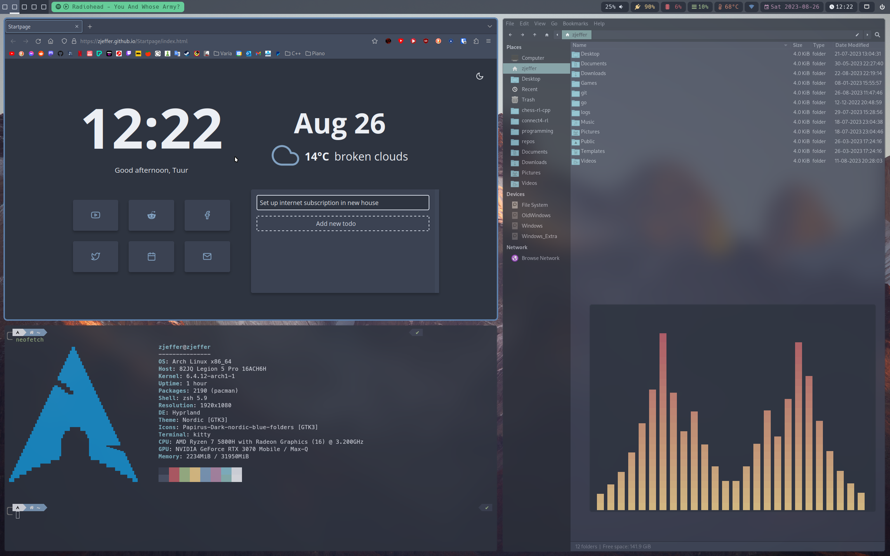
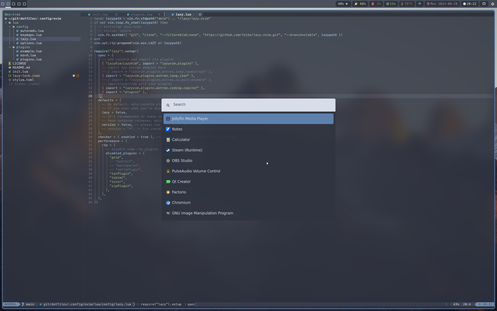
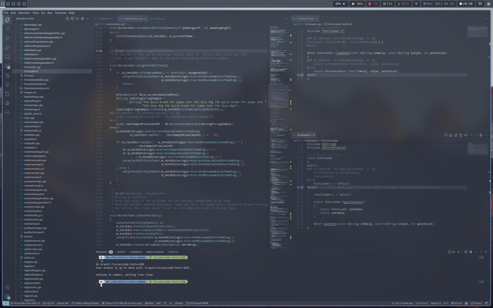
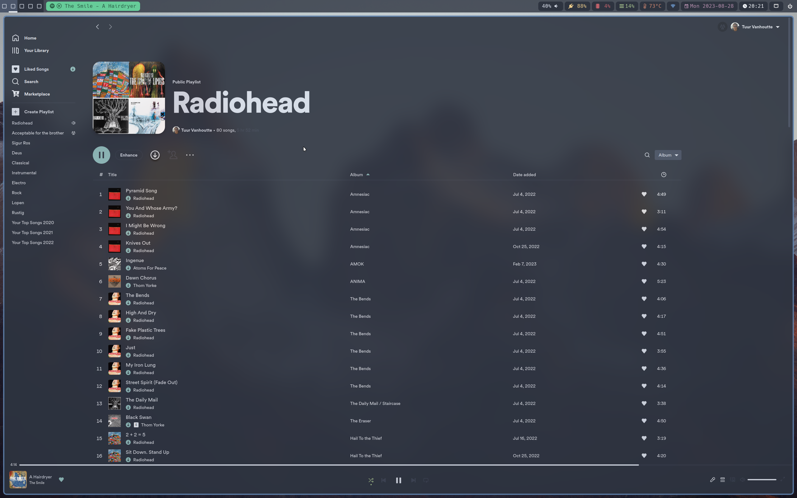

# dotfiles

These are my dotfiles for my Hyprland rice, using Arch Linux

More info below images.







# Special thanks

* adi1090x: https://github.com/adi1090x for his amazing work with customization
* `/r/unixporn`: http://www.reddit.com/r/unixporn and their discord
* The Nord theme creators at https://www.nordtheme.com

# Configuration

To use my config, there is a script `./setup_script.sh` that will symlink all the config files in this repo to ~/.config. 
Warning! This will remove any existing files and folders in ~/.config that are also in this repo.

# Packages
### Hyprland
`paru -S hyprland-nvidia-git`

Read the Hyprland wiki: https://wiki.hyprland.org/Getting-Started/Master-Tutorial/

### Utilities
* Notifications: `paru -S dunst`
* Screenshots: `paru -S grimblast-git slurp grim`
* Screen sharing: `paru -S pipewire wireplumber xdg-desktop-portal xdg-desktop-portal-hyprland-git`
* Fix fonts and find new fonts: `paru -S nerdfix`
* Authentication agent: `paru -S polkit polkit-gnome gnome-keyring`
* Qt Wayland support: `paru -S qt5-wayland qt6-wayland`

### Login/display manager: SDDM
`paru -S sddm-git sddm-theme-deepin-git`

### Bootloader
* [rEFInd](https://wiki.archlinux.org/index.php/REFInd) with [Ursa-Major theme](https://github.com/kgoettler/ursamajor-rEFInd)
* `paru -S refind intel-ucode efibootmgr`
* `sudo refind-install`
* Boot options: `root=/dev/nvme0n1p1 rw quiet splash loglevel=4 vga=current udev.log_priority=3 vt.global_cursor_default=0 nvidia-drm.modeset=1 nowatchdog audit=0 initrd=intel-ucode.img`

### Zsh
* `paru -S zsh zsh-autosuggestions zsh-completions zsh-syntax-highlighting`
* [Oh-My-Zsh](https://github.com/ohmyzsh/ohmyzsh)
* [powerlevel10k](https://github.com/romkatv/powerlevel10k#get-started)

### Pacman/paru
* Get `paru` from [here](https://github.com/Morganamilo/paru)
* In `/etc/pacman.conf`:
	* Uncomment `Color`
	* Set ParallelDownloads = 20
	* Enable the multilib repo

### Vim
`paru -S vim neovim powerline`

### Firefox
* `paru -S firefox`
* Make Firefox ignore GTK theme:
	* Go to about:config, set `widget.content.gtk-theme-override` to something like `Breeze:light` (make sure Breeze theme is installed).
* Right click immediately picks the first option, fix:
	* Go to about:config, set `ui.context_menus.after_mouseup` to `true`.
* Disable full screen warning: 
	* Go to about:config, set `full-screen-api.warning.timeout` to `0`.
* Enable GFX webrender:
	* Go to about:config, set `gfx.webrender.all` to `true`.
### Terminal
`paru -S kitty-git kitty-shell-integration-git kitty-terminfo-git` 

### File manager
* `paru -S thunar thunar-archive-plugin thunar-media-tags-plugin thunar-volman gvfs ntfs-3g tumbler`
* `paru -S ranger highlight w3m`
* Add `inode/directory=thunar.desktop` to `~/.config/mimeapps.list` under `[Default Applications]` 

### Media
* `paru -S vlc vlc-pause-click-plugin`
* `paru -S qt6-tools` (needed for qdbus commands)
* `paru -S pipewire-pulse pulseaudio pulseaudio-ctl pulseaudio-alsa alsa-lib pavucontrol`

#### Fix pulseaudio volume adjust delay
* https://community.spotify.com/t5/Desktop-Linux/Delay-when-changing-volume/m-p/1843731#M2065
* Set `enable-deferred-volume` to `no` (and uncomment) in `/etc/pulse/daemon.conf`. 

#### Fix pulseaudio pop on idle
* https://askubuntu.com/a/1266632/852424

### Networking
`paru -S networkmanager networkmanager-applet nm-connection-editor`

### Themes
* `paru -S nordic-polar-theme-git nordic-theme-git`
* [Nord theme in vim](https://github.com/arcticicestudio/nord-vim)
* `paru -S qt5ct qt6ct`
* `paru -S capitaine-cursors`
* `paru -S lxappearance` to set the global theme, icon theme and cursor theme.

### Spotify
* `paru -S spotify spicetify-cli spicetify-themes-git`
* Fix permissions: [Solution](https://github.com/khanhas/spicetify-cli/wiki/Installation#spotify-installed-from-aur)
* Set spotify data file to folder on different drive: [Solution](https://community.spotify.com/t5/Desktop-Linux/Spotify-downloads-to-the-wrong-folder/m-p/4854706/highlight/true#M19161)

### Waybar
`paru -S waybar-hyprland-git`

### Mouse driver (Logitech G502)
`paru -S piper-git`

### GPU Drivers
`paru -S nvidia nvidia-utils lib32-nvidia-utils`

Enable DRM KMS to eliminate tearing: https://wiki.archlinux.org/index.php/NVIDIA#DRM_kernel_mode_setting.
Don't forget the pacman hook!

### CPU settings
* `paru -S cpupower`
* Set `governor='performance'` in `/etc/default/cpupower` to change the default governor.
* Enable the service at boot: `sudo systemctl enable cpupower.service`

### Other
* `paru -S git npm python2 python ruby php xclip neofetch cava kcolorchooser ksysguard spectacle simplescreenrecorder htop gparted numlockx redshift xcape powerline powerline-common powerline-fonts polkit-kde-agent light gucharmap`
* Stop rtkit-daemon log spam: 
	* Create `/etc/systemd/system/rtkit-daemon.service.d/override.conf`
	```
	[Service]
	LogLevelMax=notice
	```
# Fonts:
* ttf-bitstream-vera 
* ttf-dejavu 
* ttf-droid 
* ttf-font-awesome 
* ttf-hack
* ttf-inconsolata
* ttf-liberation 
* ttf-material-design-icons
* ttf-roboto
* ttf-unifont
* noto-fonts
* noto-fonts-emoji
* powerline-fonts
* otf-font-awesome
* gnu-free-fonts

[](https://hits.seeyoufarm.com)
